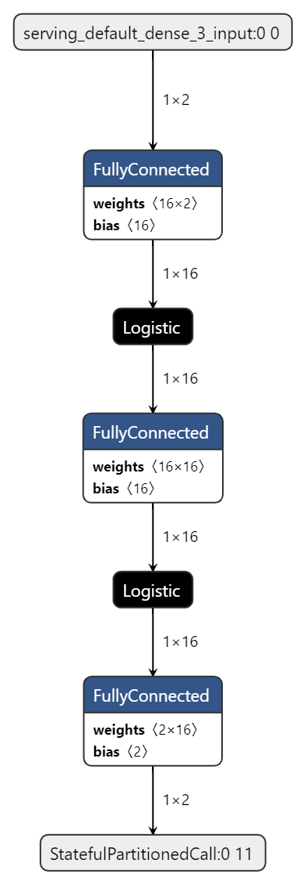

# TOI 1. projekt
## Jan Tomeček, xtomec09

Projekt byl vyvýjen v VS Code s rozšířením Eepressif IDF v1.6.1, ne v Platformio kvůli potížím s kompatibilitou.

Kódy v projektu vychází z příkladů kódu z Dokumentace a Githubu Eepressif IDF

## Popis funkčnosti

Po startu se mikrokontroler připojí k WIFI (nutno nastavit konstanty **EXAMPLE_ESP_WIFI_SSID** a **EXAMPLE_ESP_WIFI_PASS** v souboru `wifi.c`) následně proběhne inicializace knihovny tensorflow lite micro (soubor `neural_network.cc`) a následně inicializace připojení na SNTP pro získání času a spustí se 3 úlohy:
- onewire
- dth
- logdata

### OneWire task
Komunikace se senzorem DS18b20

Pomocí knihoven `ESP-owb` a `ESP-ds18b20` zahájí onewire komunikaci s teplotním senzorem. Následné každých ~10minut získává naměřenou teplotu a ukládá ji do sdílené proměnné `float ds_temp`.

### DHT task
Komunikace se senzorem DHT11

Pmocí knohovny ESP32-DHT11 zahájí spojení se senzorem a každých ~10minut získává naměřenou teplotu a vlhkost a ukládá ji do sdílených proměnných `int dht_temp` a `int dht_humidity`.

### Logdata Task
Hlabvní task, který zasílá na MQTT server naměřená data a predikovaná data z neuronové sítě.

Zahájí komunikaci s MQTT serverem a následuje smyčka, kde:

Synchronizuje čas a získá aktuální čas. Potom získá predikované hodnoty z neuronové sítě a na základě predikce vybere, kterou naměřenou teplotu (z kterého senzoru - DS18b20, nebo DHT11) zašle na MQTT server. Tato smyčka se také opakuje každých ~10minut

data jsou zasílány ve formátu JSON v tomto tvaru:
```
{'time':'','temperature':'','humidity':'', 'predTemp':'', 'predHum':''}
```

Pro komunikaci s MQTT serverem je nutné nastavit **ACCESS_TOKEN** v souboru `mqtt.c`

### Model neuronové sítě


### Dashboard z ThingsBoard serveru
http://147.229.12.176:8080/dashboard/be00cb00-c8cc-11ed-97e5-237c767902d9?publicId=ce3f2e20-c9a4-11ed-97e5-237c767902d9